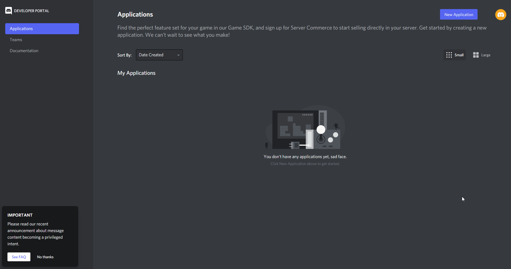
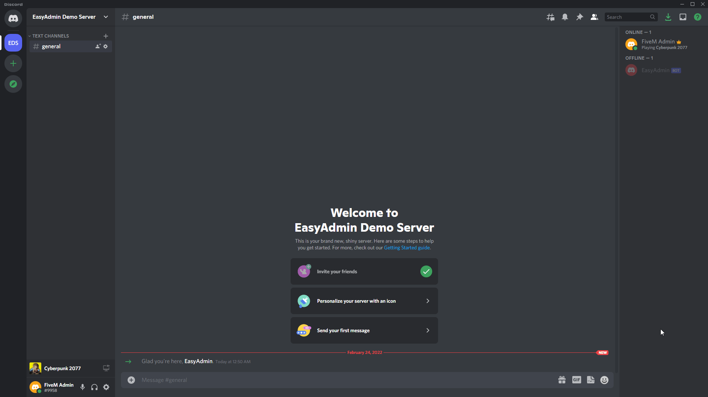

# Discord Bot

EasyAdmin 6.6 ships with a Discord Bot that allows admins to manage their server entirely from Discord.


## features

The Discord Bot ships within EasyAdmin and does not need an external host to run on, this is beneficial for people running a containerized FiveM server, or are renting a server with ZAP-Hosting, as these can simply use the bot within their FiveM server.

The current feature set includes:

- most user actions (kick, (un)ban, mute, freeze, slap, warn)
- ability to add and remove principals, allowing discord users to be added to ACE groups on discord, without having to join or edit the server.
- A live server status, with player count infos, admins online, open&claimed reports, active entities, amount of upvotes assigned to the server and uptime
- area cleanup for vehicles, peds and objects
- A player list with pagination (fully onesync compatible)
- A player info display (including identifiers)


## creating the bot user

To create a bot user, we will head over to [Discord Developer Apps](https://discord.com/developers/applications) and create a new application as shown here:



## inviting the bot

To invite the bot to your discord server, copy the following link:

```
https://discord.com/oauth2/authorize?scope=applications.commands%20bot&permissions=277562354688&client_id=MY_BOT_ID
```

Replace `MY_BOT_ID` with your bot's application id from here:


Then simply open the link and invite the bot to your discord server!


## configuring the Bot

To actually have EasyAdmin log into the bot, we need to configure the following convars:

```
ea_botToken 'botToken'
ea_botGuild 'guildId'
```

Fill out your bot token you got from the discord developer page, to get your guild id, see here:



Now simply start EasyAdmin, if everything went correctly you should see a

```
[    script:EasyAdmin] Logged in as BotName#1234!
```

Message appear in your console and the bot should show as "online" on your discord server.

> The owner of the discord server will automatically have all permissions to the bot, for other Admins these need to be assigned manually (`easyadmin.bot`)

To test if the bot is working properly, you can run `/playerlist`, the output should look something like this:


## configuring permissions

Unlike the EasyAdmin gui, the bot permissions are all contained within the `easyadmin.bot` category, this allows restricting groups to have to do actions on the server, instead of using discord, where exact actions may not be reproducable due to changing usernames.

a list of current permissions is:

```
easyadmin.bot.add_ace
easyadmin.bot.add_group
easyadmin.bot.remove_ace
easyadmin.bot.remove_group
easyadmin.bot.ban
easyadmin.bot.cleanup
easyadmin.bot.freeze
easyadmin.bot.kick
easyadmin.bot.mute
easyadmin.bot.playerinfo
easyadmin.bot.playerlist
easyadmin.bot.slap
easaydmin.bot.unban
easyadmin.bot.unfreeze
easyadmin.bot.unmute
```

for default permissions for normal admins, which are not meant to change permissions, we recommend the following preset:


```
add_ace group.admin easyadmin.bot.freeze allow
add_ace group.admin easyadmin.bot.kick allow
add_ace group.admin easyadmin.bot.mute allow
add_ace group.admin easyadmin.bot.playerinfo allow
add_ace group.admin easyadmin.bot.playerlist allow
add_ace group.admin easyadmin.bot.slap allow
add_ace group.admin easyadmin.bot.unfreeze allow
add_ace group.admin easyadmin.bot.unmute allow
```


## extra features


### bot logging channel

To create a log channel for the bot, simply copy the channel id (right click, Copy ID) and add the following convar to your server.cfg:

```
set ea_botLogChannel "ChannelId"
```

After rebooting your server, the bot should send it's first log message:


### live server status

To enable the live server status, create a new channel on your which is read-only to all roles except the bot, this is required as the bot will constantly update it's original message with the new server infos.


Once you have created the channel and copied it's id, you can configure it with the following convar:

```
set ea_botStatusChannel "ChannelId"
```

After rebooting your server, the bot should now post the status message in your configured channel:


