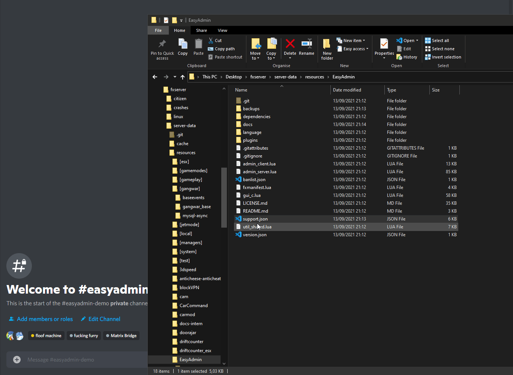

# Generating a Support File


EasyAdmin can generate a json file that includes important debugging Informations which can be used to identify and solve issues with may occur with EasyAdmin, in this Page we explain how to generate and use this File.


To use the `support.json` file, it is required to join our [Support Discord](https://discord.gg/GugyRU8), as the Discord bot on it reads and identifies issues automatically.

## Generating the File

To Generate a Support file, we need direct access to the Server's Console, with ZAP-Hosting, this console can be found in the "Overview", it is usually a black button with a `>_` Text on it, on txAdmin the `Live-Console` can be used, and on self-hosted Servers, simply typing it into the Commandline suffices.

Once we have our Console open we type the following command:


```
ea_generateSupportFile
```

the Output should then look something like this:


In the bottom line we can then see the path where the Supportfile was saved to, this path we can simply open:


## Uploading the File

Now we simply Drag and Drop it into our Support Thread, the bot will then check the file automatically:




Done!

If you still cannot figure out what exactly the issue is, please describe the exact issue you're experiencing in the Channel, someone will reply to you soon!
